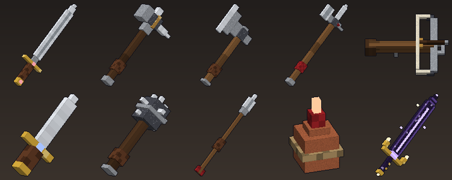

# ⚔️ 중세 무기고 (Medieval Arsenal) — 마인크래프트 베드락 애드온

3D 모델로 된 중세 무기 9종과 전설 무기 **신초의 검**, 기력(Stamina) 시스템, 무기별 고유 능력, 전용 사운드·파티클을 추가하는 **마인크래프트 베드락 에디션** 애드온입니다.



- **행동 팩** `Medieval_BP/`: 아이템, 투사체 엔티티, 조합법, 스크립트(Script API `@minecraft/server` 2.0.0)
- **리소스 팩** `Medieval_RP/`: 3D 무기 모델(attachable), 3D 렌더 아이콘, 텍스처, 파티클 16종, 효과음 23종, 한국어/영어 번역
- **요구 버전**: Minecraft Bedrock **1.21.90 이상**

---

## 설치

1. `dist/Medieval_Arsenal.mcaddon` 파일을 실행(더블클릭)하면 두 팩이 한 번에 가져와집니다.
   (따로 넣고 싶다면 `dist/Medieval_Arsenal_BP.mcpack`, `dist/Medieval_Arsenal_RP.mcpack` 사용)
2. 월드 설정 → **행동 팩**에서 `중세 무기고 (행동)`을 켭니다. 리소스 팩은 자동으로 같이 적용됩니다.
3. 월드에 처음 들어가면 **기사의 교본**이 지급됩니다. 우클릭하면 무기 도감과 설정을 볼 수 있습니다.

> 테스트용: 치트를 켜고 `/scriptevent mdv:kit` 를 입력하면 모든 무기와 보급품을 받습니다.
> `/scriptevent mdv:stamina 100` 으로 기력을 설정할 수 있습니다.

---

## 무기

모든 무기는 **들고 우클릭**하면 고유 능력이 발동하며, 능력은 **기력**을 소모합니다.

| 무기 | 공격력 | 능력 (우클릭) | 기력 | 재사용 | 패시브 |
|---|---|---|---|---|---|
| 🗡️ **기사의 롱소드** | 9 | **돌진 베기** — 전방으로 돌진하며 경로의 모든 적을 벰 | 20 | 2초 | — |
| 🔨 **전투 망치** | 12 | **대지 강타** — 도약 후 내려찍어 충격파. 높이 떨어질수록 강함, 공중에서 쓰면 즉시 내려찍기, 낙하 피해 없음 | 35 | 4초 | 적을 크게 밀쳐냄 |
| 🪓 **전투 도끼** | 11 | **회전 베기** — 3회 회전하며 주변 적을 베고 출혈 | 30 | 3.5초 | 25% 확률 출혈 |
| 🔱 **미늘창** | 10 | **관통 찌르기** — 전방 6.5블록 직선상 모든 적 관통 | 18 | 1.5초 | 적을 밀어 거리 유지 |
| 🏹 **중석궁** | — | **장전 사격** — 누르고 있으면 장전, 놓으면 발사. 완전 장전 시 치명타 | — | — | 빠른 장전·관통·다중 발사·힘 마법 적용 |
| 🔪 **단검** | 6 | **그림자 걸음** — 연막과 함께 뒤로 도약, 3초 투명화+신속 | 20 | 5초 | **기습**: 등 뒤 공격 시 2배 피해+출혈 |
| ⚙️ **모닝스타** | 10 | **기절 강타** — 5초 안의 다음 공격이 확정 기절(3초)+6 추가 피해 | 15 | 3초 | 20% 확률 기절 |
| 🎯 **투창** | 7 | **투척** — 12 피해, 떨어진 자리에서 회수 가능 (8개 묶음) | 10 | 0.8초 | — |
| 🔥 **화염 항아리** | — | **투척** — 깨지며 주변 적을 불태움 (16개 묶음) | — | 1초 | — |
| 🔮 **신초의 검** (전설) | 16 | **태초의 마법진** — 발밑에 거대한 마법진을 펼쳐 6블록 안의 적을 끌어당겨 묶고, 1초 뒤 마법진 폭발(20) + 빛의 참격 3연발(각 18, 16블록) | 60 | 10초 | **균열**: 25% 확률로 작은 마법진이 터지며 추가 마법 피해 8 + 시듦. 부서지지 않음 |

### 보조 아이템

| 아이템 | 효과 |
|---|---|
| 📯 **전쟁 뿔피리** | 16블록 내 아군에게 힘·신속·저항(10초), 길들인 늑대에게 힘, 주변 몬스터에게 나약함. 기력 40, 재사용 60초 |
| 🧪 **기력의 강장제** | 마시면 기력 50 회복 + 재생 |
| 🏅 **용맹의 훈장** | 사용 시 최대 기력 영구 +20 (100 → 최대 200) |
| 📖 **기사의 교본** | 무기 도감 / 전투 안내 / 설정(HUD, PvP, 불 번짐) |
| ⛓️ **단련된 강철** | 무기 재료 & 모루 수리 재료 |
| ➶ **석궁 볼트** | 중석궁 탄약 (화살보다 피해 +2, 블록에 맞으면 50% 확률로 회수) |

### 기력 시스템

- 기본 최대 기력 100, 초당 6 회복 (능력 사용 직후 1.5초는 회복 정지, 달리는 중엔 느림)
- 무기를 들고 있으면 화면 하단에 기력 바와 능력 재사용 대기 시간이 표시됩니다
- 크리에이티브 모드에서는 기력·탄약·내구도를 소모하지 않습니다

### 설정 (기사의 교본 → 설정)

| 설정 | 범위 | 기본값 |
|---|---|---|
| 기력 HUD 표시 | 개인 | 켬 |
| 능력으로 플레이어 공격 허용 (PvP) | 월드 (관리자) | 끔 |
| 화염 항아리가 불을 번지게 함 | 월드 (관리자) | 끔 |

---

## 조합법 (제작대)

| 결과 | 재료 |
|---|---|
| 단련된 강철 | 철괴 2 + 석탄(또는 숯) — 무형 |
| 기사의 롱소드 | `_S_` / `_S_` / `GHG` (S=단련된 강철, G=금괴, H=막대기) |
| 전투 망치 | `SBS` / `SHS` / `_H_` (B=철 블록) |
| 전투 도끼 | `SS` / `SH` / `_H` |
| 미늘창 | `_SS` / `_HS` / `H__` |
| 중석궁 | `SCS` / `TWT` / `_W_` (C=쇠뇌, T=실, W=막대기) |
| 단검 | `S` / `N` (N=금 조각) |
| 모닝스타 | `NSN` / `_H_` / `_H_` (N=철 조각) |
| 투창 ×4 | `__S` / `_H_` / `H__` |
| 화염 항아리 ×2 | 화분 + 화약 + 석탄 + 실 — 무형 |
| 석궁 볼트 ×6 | `N` / `H` / `F` (N=철 조각, F=깃털) |
| 기력의 강장제 | 유리병 + 설탕 + 사과 + 밀 — 무형 |
| 용맹의 훈장 | `RLR` / `GDG` / `_G_` (R=빨간 염료, L=청금석, D=다이아몬드) |
| 전쟁 뿔피리 | 염소 뿔 + 금괴 + 가죽 — 무형 |
| 기사의 교본 | 책 + 금 조각 — 무형 |
| 신초의 검 | `ENE` / `AKA` / `ESE` (E=메아리 조각, N=네더의 별, A=자수정 조각, K=기사의 롱소드, S=네더라이트 주괴) |

---

## 3D 모델과 에셋 생성기

모든 텍스처·모델·아이콘·효과음은 `tools/`의 파이썬 생성기로 만들어집니다 (표준 라이브러리만 사용, 설치 불필요).

```
python3 tools/generate_assets.py   # 모델/텍스처/아이콘/사운드/아이템 JSON 재생성
python3 tools/preview.py           # docs/showcase.png (3D 미리보기) 재생성
python3 tools/build.py             # 검증 + dist/ 에 .mcaddon/.mcpack 패키징
python3 tools/build.py --regen     # 재생성 + 검증 + 패키징
```

| 파일 | 내용 |
|---|---|
| `tools/models.py` | 무기 3D 모델 정의 (큐브 목록 + 재질), 손에 쥐는 자세(`HOLD`) |
| `tools/generate_assets.py` | 박스 UV 텍스처 아틀라스, geometry, 3D 레이트레이싱 아이콘, attachable, 아이템 JSON |
| `tools/sounds.py` | 절차적 효과음 합성 (칼 부딪힘, 석궁 현 튕김(Karplus-Strong), 뿔피리 등) |
| `tools/pngkit.py` | 의존성 없는 PNG 캔버스 |

하나의 모델 정의에서 **3D geometry, 그에 맞는 텍스처, 인벤토리 아이콘**이 함께 만들어지므로 셋이 항상 일치합니다.
재질(`wood`, `leather`, `steel`, `gold` …)마다 나뭇결, 가죽 감개, 칼날의 홈(fuller)과 날 같은 패턴이 자동으로 그려집니다. 보석/불씨(`ruby`, `sapphire`, `ember`)는 발광 텍셀로 표시됩니다.

### 3D 모델 좌표계

- 원점 `[0,0,0]` = 손(`rightItem`/`leftItem` 본)에 쥐는 지점, **-Z = 칼끝/창끝 방향**, +Y = 위
- 무기가 손에서 어긋나 보이면 `tools/models.py`의 `HOLD` 표에서 1인칭/3인칭 회전·위치·크기를 조정한 뒤
  `python3 tools/build.py --regen` 을 실행하세요.

---

## 스크립트 구조 (`Medieval_BP/scripts/`)

```
main.js               이벤트 → 능력 연결, 첫 접속 교본 지급, /scriptevent
config.js             모든 밸런스 수치 (피해, 기력, 재사용 대기 …)
systems/stamina.js    기력 (회복, 저장)
systems/cooldowns.js  능력 재사용 대기
systems/status.js     출혈 / 기절 상태이상
systems/projectiles.js 볼트·투창·화염 항아리 발사와 명중 처리
systems/hud.js        액션바 HUD (기력 바, 대기 시간, 장전 게이지)
systems/settings.js   월드/개인 설정
weapons/melee.js      롱소드·망치·도끼·미늘창·단검·모닝스타 능력 + 패시브
weapons/ranged.js     중석궁·투창·화염 항아리
weapons/support.js    전쟁 뿔피리, 강장제, 훈장
ui/codex.js           기사의 교본 UI
```

밸런스를 바꾸려면 `config.js`만 수정하면 됩니다 (재사용 대기 시간은 아이템 JSON의 `minecraft:cooldown`과 맞춰 두었습니다 — `tools/generate_assets.py`의 `ITEMS` 표).

---

## 참고 / 알려진 한계

- 스크립트는 `@minecraft/server` 2.0.0 / `@minecraft/server-ui` 2.0.0 타입 정의로 타입 검사를 통과했지만, **실제 게임 안에서의 테스트는 아직 하지 않았습니다.** 특히 3D 모델의 손 위치(1인칭 시점)는 `HOLD` 값 조정이 필요할 수 있습니다.
- 투사체(볼트·투창)의 방향 회전은 바닐라 화살과 같은 방식(`q.target_x_rotation`)을 사용합니다.
